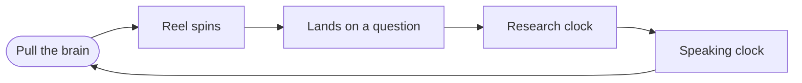

# Braincell

A slot-machine for study questions. Pull the cord, land on a question, research it for a set time, then say your answer out loud against a clock.

Live: https://super-brains-darealbadas-projects.vercel.app

## What it does

- **Three modules** — HCI, Cloud Computing, ERP, or Random across all three.
- **Two reels** — *Questions* (full research questions) or *Concepts* (short concept titles).
- **Physical trigger** — drag the brain pendant down; the elastic cord stretches, snaps back, and the snap fires the spin. A Spin button does the same thing.
- **Weighted reel** — motion-ticked deceleration that lands on a random row and never repeats the row it started on.
- **Two-phase clock** — a research countdown, then a speaking countdown, with pause, done, restart and reset.
- **Settings** — research length (5–30 min), speaking length (1–3 min), spin length, sound, ghost previews, and auto-start after a spin.

## Files

| File | Role |
| --- | --- |
| `index.html` | The whole site — markup, styles, logic, favicon. No build step, no dependencies. |

Fonts (Cormorant Garamond, Lora) and the brain glyph load from CDNs; everything else is inline.

## How it works



Pull the pendant, land on a question, research it, then answer out loud. Pause, skip ahead or reset at any point.

## Editing the question bank

All content lives in the `DATA` object at the top of the `<script>` block:

```js
DATA = {
  "Module name": {
    research: [ "question", … ],   // main question set
    wider:    [ "question", … ],   // appended to research in Questions mode
    concepts: [ ["Concept title"], … ]  // Concepts mode
  }
}
```

Add a module by adding a key, then adding its name to the `CATS` array (keep `"Random"` last).

## Deploying

Static single file. Upload `index.html` to any host, or point Vercel/Netlify at this repo with no build command and the repo root as the output directory.
